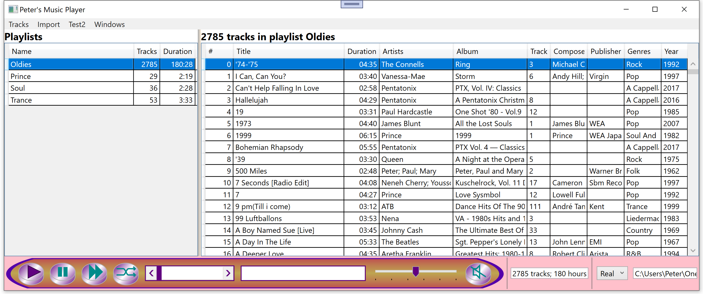
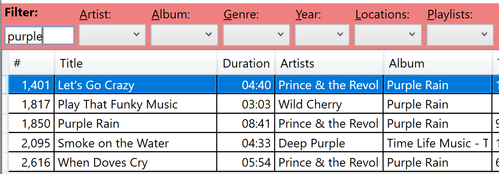

# MusicPlayer
Here is a player of of music files which can deal with big file collections 
quickly and guarantees to play each track only once, even in shuffle mode, before 
any track gets repeated. A lot of work was put into playlists, so that they can be 
easily generated and managed. It can play any file format Windows knows to play.

You can use it out of the box, or, if you are like me, you can add features as you
please. It is completely written in C# using WPF.

## Start Screen

The main screen shows the playlists on the left and the items of the 
selected Oldies playlist on the right. At the bottom are the buttons to play, 
pause, skip to next track and shuffle mode. By the way, if you don't like the looks 
of the user interface, you can easily change it, it is all WPF.

There are different windows for importing tracks, managing all tracks or just 
managing a single playlist. They all display the tracks in a DataGrid, which gives 
great flexibility to search, sort and filter them.

## Track Filter

The user can search for any text in track title, album name, composer, 
publisher, genre, year and hard disk folder. All this information is 
stored in the track files themselves, which is kind of cumbersome to edit 
in Windows File Explorere. The MusicPlayer supports changing them directly 
in the application.

## Data Storage

Information about the tracks, playlists, etc. are stored in CSV files on 
the local hard disk using my library 
[StorageLib](http://github.com/PeterHuberSg/StorageLib). It is a 
replacement for a database with the advantages:
+ Just define your classes and their properties, *StorageLib* will create all the code needed for storing the data permanently
+ Support for hierarchical data structures, guaranteeing the data integrity (no child without a parent).
+ Transaction support
+ Automatic backup
+ all data stored in RAM, resulting in extremly fast data access using LINQ.

